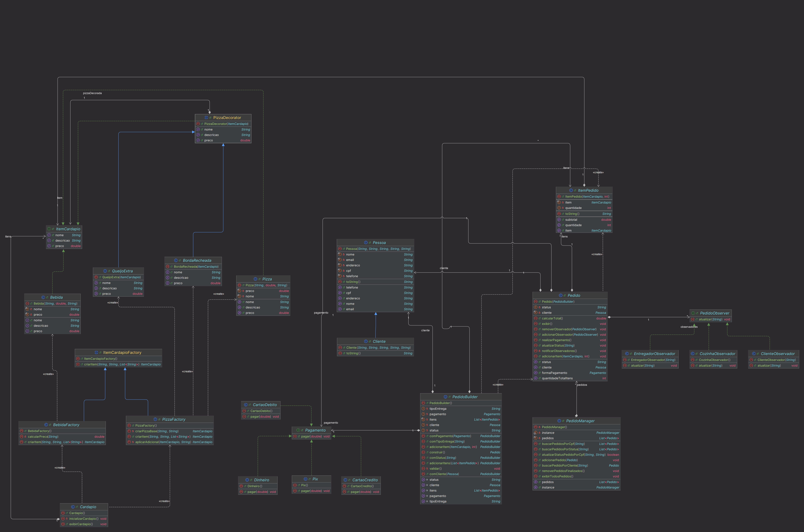

# Pizzaria – Projeto RA2 (Design de Software)

> Sistema de gerenciamento de pedidos para uma pizzaria, com aplicação de múltiplos padrões de projeto para estrutura flexível, extensível e de fácil manutenção.  
> Especificação completa disponível em _Especificação do Projeto – RA2_.

<div>

<div>

---

## Sumário

- [Pizzaria – Projeto RA2 (Design de Software)](#pizzaria--projeto-ra2-design-de-software)
    - [Sumário](#sumário)
    - [Contexto](#contexto)
    - [Diagrama de Classes](#diagrama-de-classes)
    - [Padrões de Projeto](#padrões-de-projeto)
    - [Desafios Encontrados](#desafios-encontrados)
    - [Pré-requisitos](#pré-requisitos)
    - [Como Compilar e Executar](#como-compilar-e-executar)

---

## Contexto

Este projeto implementa um sistema de gerenciamento de pedidos para uma pizzaria, permitindo:

- Exibição de itens do cardápio (pizzas e bebidas), com complementos dinâmicos (queijo extra, borda recheada)
- Criação de pedidos passo-a-passo via builder
- Processamento de pagamentos por múltiplas estratégias (cartão, Pix, dinheiro)
- Notificação automática de clientes, cozinha e entregadores sobre mudanças de status do pedido
- Centralização dos pedidos em uma única instância gerenciadora

---

## Diagrama de Classes

O diagrama completo está em docs/DiagramaClasses.puml (ou exportado como docs/DiagramaClasses.png).  
Basta usar o PlantUML ou importar no draw.io conforme instruído no relatório.

---

## Padrões de Projeto

Implementamos _seis_ padrões GoF, atendendo ao requisito de pelo menos quatro padrões.

| Padrão    | Classes/Interfaces                                                         | Descrição                                                |
| --------- | -------------------------------------------------------------------------- | -------------------------------------------------------- |
| Singleton | PedidoManager                                                              | Gerencia pedidos a partir de uma única instância.        |
| Factory   | ItemCardapioFactory, PizzaFactory, BebidaFactory                           | Cria objetos do cardápio sem expor as classes concretas. |
| Builder   | PedidoBuilder, Pedido                                                      | Constrói objetos Pedido complexos de forma fluente.      |
| Strategy  | Pagamento, CartaoCredito, CartaoDebito, Pix, Dinheiro                      | Define formas de pagamento intercambiáveis.              |
| Observer  | PedidoObserver, ClienteObservador, CozinhaObservador, EntregadorObservador | Notifica partes interessadas sobre mudanças de status.   |
| Decorator | PizzaDecorator, QueijoExtra, BordaRecheada                                 | Adiciona complementos a pizzas de modo flexível.         |

---

## Desafios Encontrados

- *Integração de padrões: combinar *Decorator dentro da Factory, mantendo baixo acoplamento.
- _Gerenciamento de observadores_: evitar vazamentos de memória ao adicionar/remover observadores.
- _Equilíbrio flexibilidade vs. complexidade_: aplicar padrões sem inflar demais a arquitetura.
- _Responsabilidade única_: manter cada classe coesa conforme princípios SOLID.

---

## Pré-requisitos

- Java JDK 8 ou superior
- Ferramenta de build (opcional): Maven ou simplesmente javac

---

## Como Compilar e Executar

1. _Clone_ este repositório:
   ```bash
   git clone https://github.com/vmlof/projeto-ra2-design.git
   cd projeto-ra2-design
   ```
